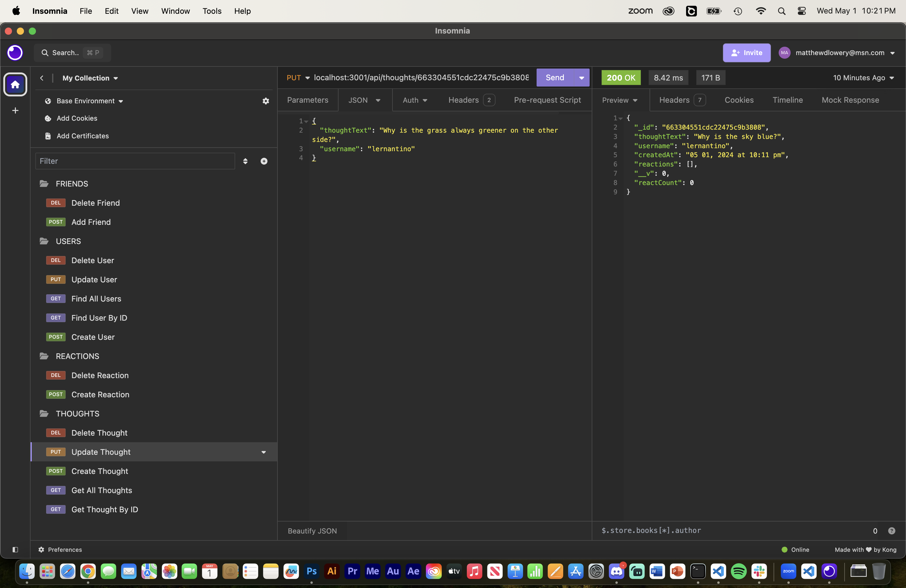

# Social Network API

## Description
The following is an API for a social network web application where users can share thoughts, create reactions to said thoughts, add friends, and create a friends list. The application uses a combination of Express.js for routing, a MongoDB database, and the Moongoose ODM. For the date, I used the native Javascript Date object.

## Screenshots

## Link to Video Demo
[Click Here to Watch a Video Demo](https://drive.google.com/file/d/1K5G5oStv6vsG0EjTCKoeCz3oBl3mq9zl/view?usp=sharing)
